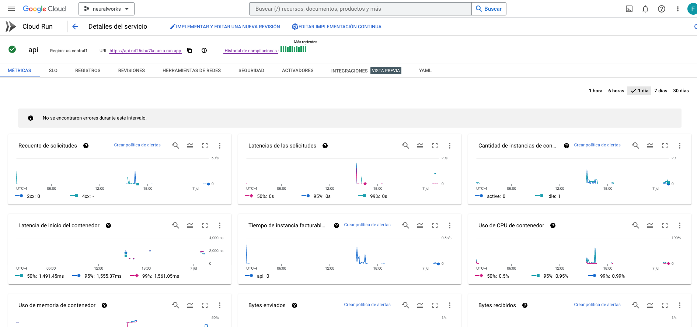

[](https://github.com/FelipeAriasT/Challenge_ML_Engineer_NeuralWorks/actions/workflows/cml.yml)

# Challenge ML Engineer NeuralWorks


Este repositorio contiene la resolución del desafío Machine Learning Engineer de NeuralWorks. Este repositorio contiene los archivos jupyter notebook to-expose.ipynb donde se explica la elección del mejor modelo desarrollado por Juan mientras que to-expose_improve.ipynb busca los mejores resultados a el modelo escogido.

Se realiza una RESP API para la predicción de vuelos atrasados con fast API. Para el montaje de la API se escogio GCP principalmente por su facildiad de uso y la documentación disponible que existe por sobre servicios como AWS o Azure. El procedimiento para el montaje fue primero con un archivo Dockerfile el creo la imagen (api), la cual fue enviada al proyecto denominado neuralworks-391916 creado en GCP. 

```
docker build -t api . #creación de la imagen del dockerfile
gcloud auth login #autenticación con GCP
gcloud auth configure-docker # configuramos el GCP con Docker
gcloud builds submit --tag gcr.io/neuralworks-391916/api  # mandamos la imagen a Container Registry
```
Posterior a este proceso, con la imagen ya cargada en Container Registry de GCP, se realiza el despliegue en Cloud Run de GCP y se realiza continuous delivery integrando este repositorio a la API con activadores de Cloud Build.



Para hacer consultas a la API, ocupar el siguiente formato cURL
```
curl --location 'https://api-od26sbu7kq-uc.a.run.app/predict' \
--header 'Content-Type: application/json' \
--data '{
    "vuelos": [
        {
            "OPERA_Aerolineas_Argentinas": true,
            "OPERA_Aeromexico": false,
            "OPERA_Air_Canada": true,
            "OPERA_Air_France": false,
            "OPERA_Alitalia": true,
            "OPERA_American_Airlines": false,
            "OPERA_Austral": true,
            "OPERA_Avianca": false,
            "OPERA_British_Airways": true,
            "OPERA_Copa_Air": false,
            "OPERA_Delta_Air": true,
            "OPERA_Gol_Trans": false,
            "OPERA_Grupo_LATAM": true,
            "OPERA_Iberia": false,
            "OPERA_JetSmart_SPA": true,
            "OPERA_K_L_M": false,
            "OPERA_Lacsa": true,
            "OPERA_Latin_American_Wings": false,
            "OPERA_Oceanair_Linhas_Aereas": true,
            "OPERA_Plus_Ultra_Lineas_Aereas": false,
            "OPERA_Qantas_Airways": true,
            "OPERA_Sky_Airline": false,
            "OPERA_United_Airlines": true,
            "TIPOVUELO_I": false,
            "TIPOVUELO_N": true,
            "MES_1": false,
            "MES_2": true,
            "MES_3": false,
            "MES_4": true,
            "MES_5": false,
            "MES_6": true,
            "MES_7": false,
            "MES_8": true,
            "MES_9": false,
            "MES_10": true,
            "MES_11": false,
            "MES_12": true
        },
        {
            "OPERA_Aerolineas_Argentinas": false,
            "OPERA_Aeromexico": true,
            "OPERA_Air_Canada": false,
            "OPERA_Air_France": true,
            "OPERA_Alitalia": false,
            "OPERA_American_Airlines": true,
            "OPERA_Austral": false,
            "OPERA_Avianca": true,
            "OPERA_British_Airways": false,
            "OPERA_Copa_Air": true,
            "OPERA_Delta_Air": false,
            "OPERA_Gol_Trans": true,
            "OPERA_Grupo_LATAM": false,
            "OPERA_Iberia": true,
            "OPERA_JetSmart_SPA": false,
            "OPERA_K_L_M": true,
            "OPERA_Lacsa": false,
            "OPERA_Latin_American_Wings": true,
            "OPERA_Oceanair_Linhas_Aereas": false,
            "OPERA_Plus_Ultra_Lineas_Aereas": false,
            "OPERA_Qantas_Airways": false,
            "OPERA_Sky_Airline": true,
            "OPERA_United_Airlines": false,
            "TIPOVUELO_I": true,
            "TIPOVUELO_N": false,
            "MES_1": true,
            "MES_2": false,
            "MES_3": true,
            "MES_4": false,
            "MES_5": true,
            "MES_6": false,
            "MES_7": true,
            "MES_8": false,
            "MES_9": true,
            "MES_10": false,
            "MES_11": true,
            "MES_12": false
        }
    ]
}
'
```

Tambien se realizaron pruebas de stress con wkr, mediante la siguiente solicitud 

```
wrk -t10 -c50 -d45s -s test/test.lua https://api-od26sbu7kq-uc.a.run.app/predict
```

Con los siguientes resultados

```
Running 45s test @ https://api-od26sbu7kq-uc.a.run.app/predict
  10 threads and 50 connections
  Thread Stats   Avg      Stdev     Max   +/- Stdev
    Latency   286.85ms   48.83ms   1.73s    76.93%
    Req/Sec    17.11      7.76    40.00     64.78%
  7584 requests in 45.08s, 1.80MB read
  Socket errors: connect 0, read 0, write 0, timeout 13
Requests/sec:    168.22
Transfer/sec:     40.90KB

```
Donde se destacan resultados como 
* Req/Sec: Muestra la cantidad promedio de solicitudes por segundo que se pudieron procesar. El promedio fue de 17.11 solicitudes por segundo, con una desviación estándar de 7.76. El valor máximo registrado fue de 40.00 solicitudes por segundo.
  
* 7584 requests in 45.08s, 1.80MB read: Indica que se realizaron un total de 7584 solicitudes durante los 45.08 segundos de la prueba. Se leyeron 1.80 MB de datos en total.

* Socket errors: connect 0, read 0, write 0, timeout 13: Muestra la cantidad de errores de socket encontrados durante la prueba. En este caso, no se encontraron errores de conexión, lectura o escritura, pero se registraron 13 errores de tiempo de espera (timeout).

* Requests/sec: 168.22: Indica la cantidad de solicitudes por segundo promedio procesadas durante la prueba. En este caso, se procesaron en promedio 168.22 solicitudes por segundo.

Estos resultados se podrian mejorar considerando en primera instancia el aumento del número de hilos y conexiones. Tambien otras consideraciones como separar la carga del modelo en la API con un modulo aparte como load_model.py y que el archivo main.py para aprovechar el caché. Por ultimo considerar la optimización los parametros de servidor de GCP como balanceadores de carga o el autoscaling.

Organización del repositorio.
------------
    │── .github/workflows                   <- Continous integration
    ├── data                                <- Carpeta con los datos necesarios para ejecutar el proyecto.
    │   ├── raw                             <- Archivos originales entregados por la contraparte del desafio.
    |   ├── processed                       <- Archivos generados.
    │
    ├── app                                 <- Carpeta que almacena las configuraciones.
    │   ├── main.py                         <- Archivo de la API.
    |
    ├── config                              <- Carpeta que almacena las configuraciones.
    │
    ├── images                              <- Carpeta que almacena las imagenes del repositorio.
    |
    ├── models                              <- Carpeta que almacena los modelos entrenados.
    │
    ├── test                                <- Carpeta con archivos para testear las funciones creadas y test de stress.
    │
    |── Dockerfile                          <- Archivo para generar el contenedor docker para GCP.
    |
    |── Makefile                            <- Archivo de configuración que automatiza la compilación y construcción de programas en sistemas Unix.
    │
    ├── README.md                           <- Documentación del código.
    │
    ├── requirements.txt                    <- Archivo con los requerimientos de librerías para poder ejecutar el proyecto.
    │
    ├── to-expose_improve.ipynb             <- Notebook con la mejora del modelo seleccionado.
    │
    ├── to-expose.ipynb                     <- Notebook entregado para la generación de los modelos y explicación del mejor modelo.
    │
    └── utils.py                            <- Archivo funciones utilizadas durante el desarrollo del proyecto.


